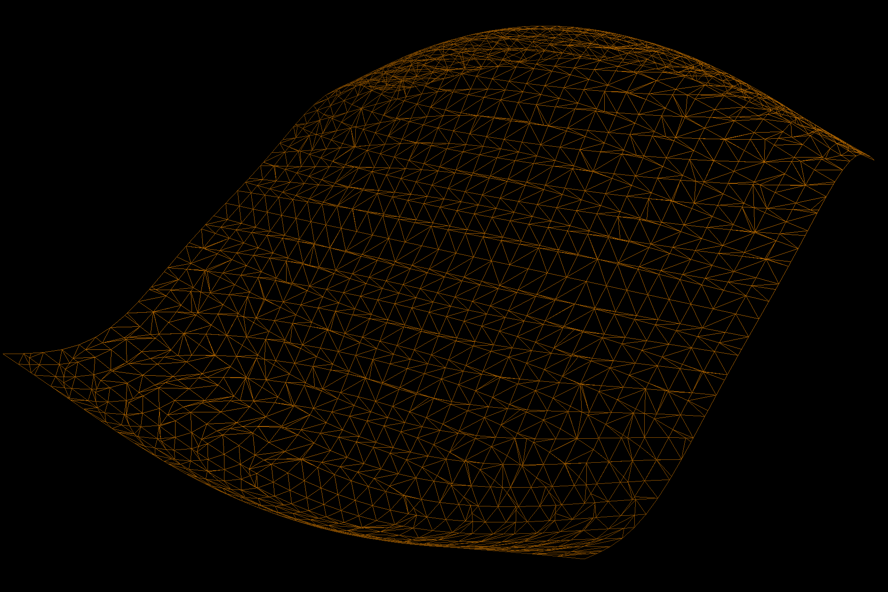

# CS354H Final Project: Metaballs

### Kaylan Tchamdjou

[](https://www.youtube.com/watch?v=GkIUIajTTPo)

Build with `cmake --build <YOUR BUILD FOLDER NAME>`. Executable will be in the build folder. Project was built with windows in mind. Not too sure how this all runs on linux machines in complete honesty!

For this project I implemented Marching Cubes along with various Metaballs. The project is done in C++ using **GLFW**, **GLAD**, and **GLM**. Run the executable with flags `-a` to see a simple animated scene of a plane getting "folded". Run the executable with flags `-b` to see the bouncing balls scene. Lastly run the executable with flags `-s` to see static meshes of various Metaballs. When running `-s` you can click the left and right arrows to change the Metaball displayed.

| Flag | Full Flag Name | Functionality              |
| :--- | :------------- | :------------------------- |
| -a   | -animation     | Rippling plane animation   |
| -s   | -scenes        | Static metaball showcase   |
| -b   | -bouncing      | Bouncing metaball showcase |

### Basic Features

- Function to Mesh Conversion via Marching Cubes
- Metaball Mesh Generation
- Metaball Normal Generation
- Diffuse Lighting / Shading
- Camera Controls (camera moves on drag)

### Update: 5/3/2025 (10:09 PM)

- Minor optimizations to increase speed
    - Instead of reallocating space for the Vector3D<ctrl_pt_t> buffer on each `refresh()` call, I instead maintain a buffer field in MetaballEngine.
    - Using `MeshView` instead of copying the meshes in the render loop
    - Skipping cubes that produce a bitfield of `0x0` or `0xFF` (0 and 255 are "empty space")

- If I really want to speed this up I need to resort to some kind of caching of Vertices

### Update: 1/7/2025 (3:16 PM)

- Huge refactor of codebase. MetaballEngine has been moved to `engine.hpp`.
    - MetaballEngine is now templated on "metaball type", where the type `M`
    - Mesh is returned on 'construct mesh'

### Usage:

###### Instantiating a Metaball Engine

The Metaball Engine can be thought of as a cube-shaped "scalar field" centered on some point `p` in World Space. Each discrete point in this scalar-field has an associated density, which when tested against some isovalue (or threshold) determines if a Vertex can be created at said point.

Furthermore, the Metaball Engine is templated over a type 'M' which represents a Metaball type. Any type that implements the interface `mbl::DynamicMetaball` can be accepted as a templated type for the Metaball Engine.

```C++
#include <engine.hpp>
// Create a cube-shaped scalar field centered at point "p" in world space,
// with side lengths "l", and # of divisions per axis (aka resolution) "r", 
// and lastly, isovalue (or threshold) "i" via MetaballEngine<M> where
// M is the Metaball type the MetaballEngine is templated over.
glm::vec3 position = glm::vec3(0.f, 0.f, 0.f);
float side_length = 20.0f;
float resolution = 10.0f;
float isovalue = 1.0f;

// Aggregate metaball is a metaball that can 'take in' any other metaball
mbl::MetaballEngine<mbl::AggregateMetaball> M(position, side_length, resolution, isovalue);
```

###### Adding & Creating Metaballs

As stated before, the Metaball Engine accepts any type that implements the mbl::DynamicMetaball interface. This can of course be achieved by creating a custom struct or class. We'll defined an "inclined plane" struct below that does exactly that.

```C++
// Very simple metaball that sums the x, y, and z input coordinates.
// When thresholded for values >= isovalue = 1, an inclined plane is drawn
struct InclinedPlane : public mbl::DynamicMetaball {
    float operator()(float x, float y, float z) const {
        return x + y + z;
    }
};

// only accepts Inclined Planes
mbl::MetaballEngine<InclinedPlane> m1(...);
m.add_metaball(InclinedPlane());

// accepts all types with operator()(float x, float y, float z) const -> float
mbl::MetaballEngine<mbl::AggregateMetaball> m2(...);
m.add_metaball(InclinedPlane());
```

Another approach to creating a metaball is by wrapping some "callable type" that has a const "callable" operator that takes in 3 floats and returns a float. In other words, a function that takes a point in 3d space and returns a scalar value.

The simplest way to do this is by passing in a `lambda (float x, float y, float z) -> float` as an argument for the constructor of `mbl::Metaball`. Below is our `InclinedPlane` in lambda form.

```C++
mbl::Metaball m = mbl::Metaball([](float x, float y, float z) -> float { return x + y + z; })
```

A disadvantage of this approach is that you lose type info and end up with a fairly "uninteresting" Metaball. An approach that remedies this is by taking our `InclinedPlane` struct and passing it into the `Metaball` just like we did with the lambda. In this scenario it's not necessary for `InclinedPlane` to implement `DynamicMetaball` itself, as it is wrapped by the `Metaball` time which implements `DynamicMetaball`. However, `InclinedPlane` still needs to have the overload on `float operator()(float,float,float)`.

```C++
struct InclinedPlane {
    float operator()(float x, float y, float z) const {
        return x + y + z;
    }
};

mbl::Metaball<InclinedPlane> ip = mbl::Metaball(InclinedPlane());
mbl::MetaballEngine<Metaball<InclinedPlane>> me = mbl::MetaballEngine(...);
size_t index = me.add_metaball(ip);

// You can directly unwrap the internal type w/ Metaball<T>, whereas
// aggregate metaball requires the use of AggregateMetaball::target and
// AggregateMetaball::target_info.
InclinedPlane& ip_ref = me.get_metaball(index).unwrap();
```

###### Creating your mesh

To process the metaballs and obtain the mesh to be used in rendering, simply call
`MetaballEngine<T>.construct_mesh()`. Doing so will return a struct of type `MeshData`.

```C++
// Making the engine
MetaballEngine<T> me = MetaballEngine(...);
me.add_metaball(...);
mbl::common::graphics::MeshData md = me.construct_mesh();

// intermediate steps where you make the VAOs, Buffers, Shaders etc. go here
// glGenVertexArrays(); glGenBuffers(); ...blah blah blah.

// Rendering with GLFW & OpenGL ... setting vertex & index data
glBindBuffer(GL_ARRAY_BUFFER, VBO);
glBufferData(GL_ARRAY_BUFFER, md.vertices.size() * sizeof(Vertex), md.vertices.data(), GL_STATIC_DRAW);

glBindBuffer(GL_ELEMENT_ARRAY_BUFFER, EBO);
glBufferData(GL_ELEMENT_ARRAY_BUFFER, md.indices.size() * sizeof(int), md.indices.data(), GL_STATIC_DRAW);

// drawing with GLFW & OpenGL
glDrawElements(GL_TRIANGLES, (GLsizei) md.indices.size(), GL_UNSIGNED_INT, 0);
```

Finally, the metaball engine only constructs a new mesh data when it is **dirty**. Currently, the dirty state
is set to true when...
1) The MetaballEngine is first constructed.
2) `MetaballEngine::isovalue` is set to a new value via `MetaballEngine::set_isovalue(float isovalue)`.
3) A `Metaball M` is add to the MetaballEngine via `MetaballEngine::add_metaball(M m)`.
4) `MetaballEngine::make_dirty()` is called.

`MetaballEngine::make_dirty` is essentially your way of indicating to the MetaballEngine that you have made some change to the engine that is outside the first 3 cases, and that you would like to recalculate density values and subsequently rebuild your mesh.

###### Video Example

You can see the engine in action in [this Youtube video](https://youtu.be/GkIUIajTTPo?si=OI2XB_iCBtpFot91). The metaballs are all blobs that travel linearly until they hit a wall, where they will bounce the opposite direction. The exact `Metaball` used is `KineticBlob` which can be found under `mbl::presets`.

```C++
struct KineticBlob {
    glm::vec3 m_center = glm::vec3(0.f);
    glm::vec3 m_velocity = glm::vec3(0.f);
    float m_scale = 1.f;

    KineticBlob(const glm::vec3& center = glm::vec3(0.0), const glm::vec3& velocity = glm::vec3(0.0), const float scale = 1.0f) 
        : m_center(center), m_velocity(velocity), m_scale(scale) {}

    float operator()(float x, float y, float z) const {
        return m_scale / (
            (float) std::pow(m_center.x - x, 2) + 
            (float) std::pow(m_center.y - y, 2) + 
            (float) std::pow(m_center.z - z, 2)
        );
    }

    glm::vec3& update(const float dt) {
        m_center = m_center + m_velocity * dt;
        return m_center;
    }
};

mbl::MetaballEngine<mbl::Metaball<KineticBlob>> engine(...);
for (int i = 0; i < num_metaballs; i++) {
    glm::vec3 position = glm::linearRand(...);
    glm::vec3 velocity = glm::sphericalRand(...);
    engine.add_metaball(mbl::Metaball(KineticBlob(position, velocity)));
}
```

Every frame `update` is called on all Metaballs in the engine. Since these changes can't be seen by the our engine, `make_dirty` is called after the loop, and we then get the new mesh.

```C++
// Update all KineticBlobs
for (int i = 0; i < num_metaballs; i++) {
    mbl::presets::KineticBlob& kb = engine.get_metaball((size_t) i).unwrap();
    glm::vec3& kb_pos = kb.update(deltaTime);
    // ... other checks on position for wall-bouncing
}

// Get the new mesh after the update
mbl::common::graphics::MeshData md = engine.make_dirty().construct_mesh();
```

#### References:

[1] William E. Lorensen and Harvey E. Cline. 1987. Marching cubes: A high resolution 3D surface construction algorithm. SIGGRAPH Comput. Graph. 21, 4 (July 1987), 163–169. https://doi.org/10.1145/37402.37422


William E. Lorensen and Harvey E. Cline. 1987. Marching cubes: A high resolution 3D surface construction algorithm. In Proceedings of the 14th annual conference on Computer graphics and interactive techniques (SIGGRAPH '87). Association for Computing Machinery, New York, NY, USA, 163–169. https://doi.org/10.1145/37401.37422


[2] http://www.paulbourke.net/geometry/polygonise/

### EXAMPLE GEOMETRIES

###### Cube Shape 

$${\sum_{i=1}^{N}(\frac{1}{(x_i-x)^4 + (y_i-y)^4 + (z_i-z)^4})}$$


###### Blob + Cube 

$${\sum_{i=1}^{N_C}\frac{1}{(x_i-x)^4 + (y_i-y)^4 + (z_i-z)^4}} + \sum_{i=1}^{N_B}\frac{1}{(x_i-x)^2 + (y_i-y)^2 + (z_i-z)^2}$$


###### Gyroid


###### Blob

$$\sum_{i=1}^{N}\frac{1}{c_{i1}(x_i-x)^2 + c_{i2}(y_i-y)^2 + c_{i3}(z_i-z)^2}$$


###### Plane + Blob

$$\sum_{i=1}^{N_P}(c_{i1}x+c_{i2}y+c_{i3}z) + \sum_{i=1}^{N_B}\frac{s_i}{(x_i-x)^2 + (y_i-y)^2 + (z_i-z)^2}$$

